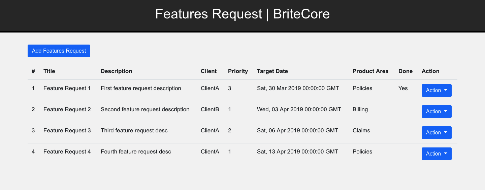
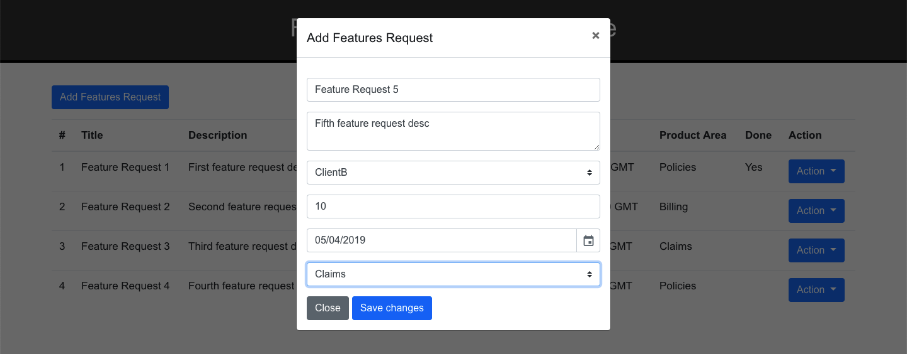
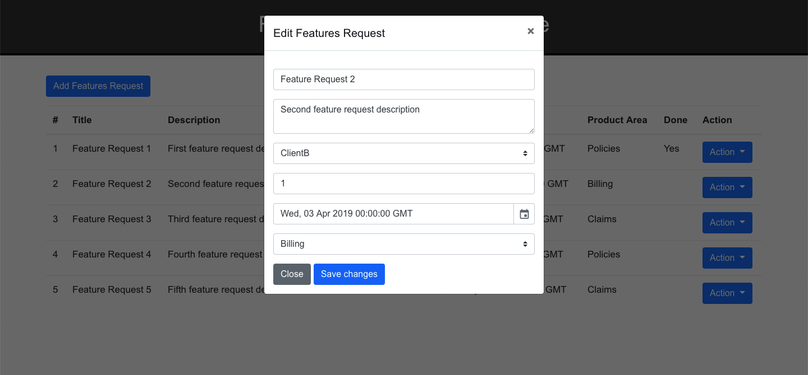

# feature-request-app
Source code for Feature Request Application. This application is build using Flask as Backend & Jquery for Frontend.

This is the display of this application.
</img>

We have add function in this application, to add Feature Request
</img>

We have edit function in this application, to edit Feature Request
</img>

In this application, I using Docker to deploy to the server. So we can deploy faster. You don't need to doing complex things to get this application run on your system. This is the guide for you to get this application run on your system.

<ol>
  <li>Make sure you have docker & docker-compose installed on your computer. If not, you can follow this <a href="https://docs.docker.com/install/">link</a> to install docker and this <a href="https://docs.docker.com/compose/install/">link</a> to install docker-compose</li>
  <li>Clone this project and cd to the directory</li>
  <li>Simply run <b>sudo docker-compose up --build -d</b> and you will get this application run on your system</li>
  <li>To make sure that you have this application running on your system, run <b>docker ps</b>, you will see that you have two container, one for backend & one for frontend</li>
  <li>Open your favorite browser and navigate to http://<your_ip>, you will see the application running. Congratulation!</li>
</ol>
